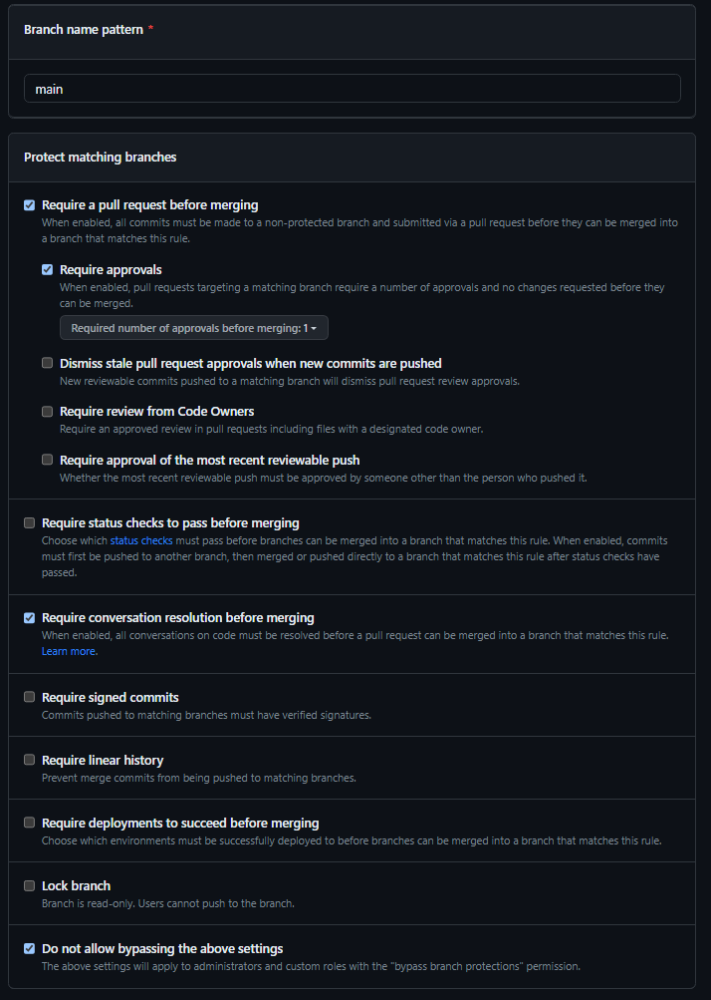

# GitHelp-En

[French here](#githelp-fr)

Very basic tutorial on how to set up and work in a team with a clean GitHub workflow, intended for game designers, artists, or anyone with little GitHub experience. This tutorial assumes you know the basics of `pushing` and `pulling`.

1. [Setting up a safe repository](#setting-up-a-safe-repository)
2. [Pull requests](#pull-requests)
   - [What is a pull request](#what-is-a-pull-request)
   - [Open a pull request](#open-a-pull-request)
   - [Review a pull request](#review-a-pull-request)
   - [Conversations](#conversations)
  
## Setting up a safe repository

Setting up a safe repository is very important when collaborating for multiple reasons :

- Less error-prone
- Follow-ups on collaborators advancements
- Main branch will look like a **milestone achievement archive** instead of a mess of commits and merge one on top of the other

This tutorial will help you achieve that goal by **protecting the main branch** (i.e. preventing direct pushes to the main branch)
To protect your main branch, go into your repository's `Settings`, then go to `Branches`, if you don't see the "Branches" tab, it may be because you don't have anything pushed on your repository, so push a small file for the time being and try this step again.

After that click on the	`Add branch protection rule`, you will be greeted with a "form" that once completed should look like this :

Here we are telling GitHub that the protection rule should apply to the branch named `main`, that we ***NEED*** to make a [pull request](#pull-requests) in order to have anything go on the main branch (There's no other way now !), at least `1` person needs to approve our Pull request's changes in order to send them on the main branch, all the pull request's [conversations](#conversations) must be resolved, and finally the last checked parameter is `Do not allow bypassing the above settings`

This one tells GitHub that these rules also apply to the owner of the repository (you) and is very much recommended, just like all the other checked parameters on the image, but feel free to read about the other parameters and add them to your liking.

## Pull requests
   - [What is a pull request](#what-is-a-pull-request)
   - [Open a pull request](#open-a-pull-request)
   - [Review a pull request](#review-a-pull-request)
   - [Conversations](#conversations)

### What is a pull request

A pull request is a way for people to work together on a project. When you're done making changes to your branch, you'll want to send a pull request to your friends. They can see the changes you've made and decide whether or not to include them in the project. That way, the main branch will stay clean, and you won't have a merge conflict every time someone pushes if you're all working on the same branch.

### Open a pull request

Let's say that you've been working on your branch and that you're ready to incorporate your changes on the main branch.
Go on GitHub, click on the `Pull requests` tab and click on `New pull request`. Then, change the right-most branch to the branch you were working on like on this example : 

After that the window will be displaying all the changes you've made and some other infos on your work. Click on `Create pull request`, here you can change the name of your pull request, add a description, etc. **Add a reviewer**, and **assign yourself and anyone that worked on this branch with you**.

When you're done click on `Create pull request` again and you will access the pull request view : 

You can see the whole history of the branch you were working on and all the actions that have been made on this pull request (e.g. requesting a review, assigning someone...).

### Review a pull request

If you've been assigned as a reviewer on someone else's pull request you have to follow these steps to make a good review : 

1. Check what has been changed in `Files changed` and commnent on any line that you don't appreciate by clicking on the `+` button when hovering on that line.
2. When you're done with your review, if everything looks fine, fix the eventual merges, then click on the drop-down menu next to ***Merge pull request*** and select `Squash and merge`, this parameter will regroup all the commits you made in your branch into one commit that will be pushed on the main branch, making it much more clean/readable.
If some things have to be changed before merging into the main branch  
### Conversations

# GitHelp-Fr

[English here](#githelp-en)

Tutoriel basique expliquant comment setup un environnement de travail GitHub, pensé pour les game designers, les artistes, ou toute personne avec peu d'expérience sur GitHub. Ce tutoriel part du principe que vous connaissez les bases des commandes `push` et `pull`
